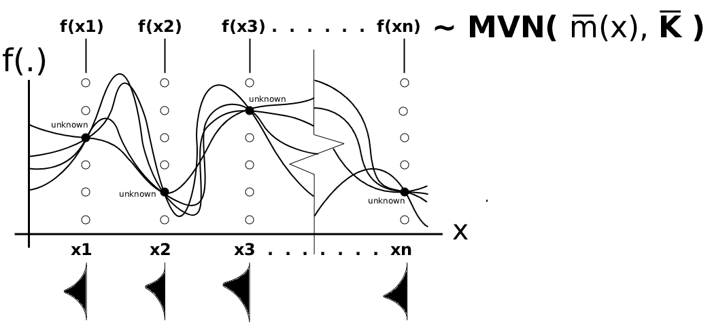
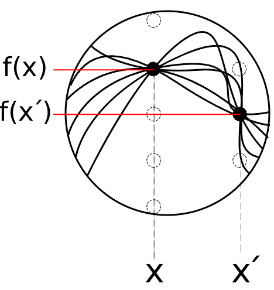

A stochastic process is a collection of random variables indexed by time, space, or some other input. A stochastic process gives you a whole sequence (unknown function) of random outcomes. A **Gaussian process (GP)** is a stochastic process such that, for any finite set of input points, the corresponding random variables follow a joint multivariate normal distribution. A GP is known for a flexible nonparametric Bayesian model used for prediction, classification, or function approximation. 

Rather than specifying a fixed functional form, a GP defines a **probability distribution over functions**. This makes it especially attractive when the underlying relationship between predictors and responses is too complex or unknown in advance.

{width="700"}

Formally, a function $f(x)$ is said to follow a GP if, for any finite collection of input points $x_1, x_2, \dots, x_n$, the corresponding vector of function values:

$$
\mathbf{f} =
\begin{bmatrix}
f(x_1) \\
f(x_2) \\
\vdots \\
f(x_n)
\end{bmatrix}
$$
has a multivariate normal distribution. This is written as

$$
\mathbf{f} \sim \mathcal{GP}\bigl( \; \mathbf{\overline{m}}(x), \; \mathbf{\overline{K}}(x, x') \; \bigr),
$$

where $\mathbf{\overline{m}}(x)$ is the **mean function** vector and $\mathbf{\overline{K}}(x, x')$ is the **variance-covariance matrix** (kernel matrix).

{width=600px}

Given input points $x_1, x_2, \dots, x_n$, the **mean function** vector is defined as 

$$
\mathbf{\overline{m}}(x) = \{ \; \mathbb{E}[f(x_1)],\; \mathbb{E}[f(x_2)],\cdots  \mathbb{E}[f(x_n)]  \;\}
$$

::: callout-note
...but usually the mean function is often taken to be $\approx 0$ if the output data has been centered or standardized...

:::

Given input points $x_1, x_2, \dots, x_n$, the **variance-covariance matrix** induced by a Kernel $k(x_i, x_j)$ is defined as

$$
\mathrm{COV}(\mathbf{f}) = \mathbf{\overline{K}}_{n \times n} =
\begin{bmatrix}
k(x_1, x_1) & k(x_1, x_2) & \cdots & k(x_1, x_n) \\
k(x_2, x_1) & k(x_2, x_2) & \cdots & k(x_2, x_n) \\
\vdots & \vdots & \ddots & \vdots \\
k(x_n, x_1) & k(x_n, x_2) & \cdots & k(x_n, x_n)
\end{bmatrix}.
$$

where

$$
\mathrm{COV}( f(x_i)\cdot f(x_j) ) = k(x_i, x_j), \qquad i,j = 1,\dots,n.
$$

::: callout-note
...but usually $k(x_i, x_j) = \mathbb{E}[f(x_i)\cdot f(x_j)]$ because $\mathrm{COV}( f(x_i)\cdot f(x_j) ) = \mathbb{E}[f(x_i)\cdot f(x_j)] - \mathbb{E}[f(x_1)]\mathbb{E}[f(x_2)]$ where $\mathbb{E}[f(x_1)]\mathbb{E}[f(x_2)]=0$

:::

### Now, let us imagine what gives this shape. 

{width="200"}

## [1]. My belief (Prior)

Do we expect the underlying function to be smooth, roughly linear, periodic, or highly wiggly? Should nearby input points lead to similar outputs, or might the function change sharply even over short distances? In GP, these assumptions are encoded through the kernel. The kernel describes **how similar two outputs are expected to be when their inputs are close or far apart**. More precisely, it defines the prior covariance between function values at two input locations. When the kernel value is large, the two outputs are strongly correlated and tend to behave similarly. When the kernel value is small, the outputs are less strongly related and may differ more substantially. In this way, the kernel is where we encode our prior beliefs about the function.

The kernel is a bit like autocorrelation, but more general. Autocorrelation tells us how much a variable resembles its past values over time. The kernel tells us how similar two future ? output values should be at any two input points. More fundamentally, autocorrelation usually describes dependence across time lags in a sequence, whereas the kernel specifies prior dependence between function values at arbitrary input locations.

From this point of view, studying the kernel is really just studying our prior beliefs about the shape of the unknown function. We now turn to the kernel in more detail.

 

#### (a) Fundamental Intuition of Kernels

At the most basic level, a kernel is a function of two inputs. It gives the information on data points that lie in the proximity of the data point under consideration...and it returns a number describing how strongly those two inputs are connected. Depending on the context, that output may be interpreted as a **weight**, a **similarity**, or a **covariance**. This is then used to solve the problem. That broad idea appears across many settings such as kernel density estimation (KDE), kernel smoothing (KS), SVM, and GP, etc. In short, a kernel measures a structured relationship between two points. The relationship is based on 1) `distance`, 2) `distance + roughness`, 3) `inner product`. Let us see one by one.

**The KDE kernel acts as a local weighting device, whereas the GP kernel acts as a covariance function describing dependence between input locations.**

In KDE, the kernel is typically written as a one-variable function $k(x_i)$, often chosen to be a symmetric bump centered at $x_i$. 
$$
k_h(x-x_i)=\frac{1}{h}k\left(\frac{x-x_i}{h}\right) \quad \text{where}\; h\; \text{is the spread of the bump}, \quad E[\mathbf{f}(x)]=\frac{1}{n}\sum_{i=1}^n k_h(x-x_i) \\
$$
If choosing the Gaussian kernel,
$$
k_h(x-x_i) = \frac{1}{h}\frac{1}{\sqrt{2\pi}} \exp\left(-\frac{1}{2}\left(\frac{x-x_i}{h}\right)^2\right)
=\frac{1}{\sqrt{2\pi}h}\exp\left(-\frac{(x-x_i)^2}{2h^2}\right).
$$
It is interpreted as a localized contribution centered at the datapoint $x_i$. The density estimate $E[\mathbf{f}(x)]$ is then obtained by summing these local kernel contributions over all observations. 
For fixed $x$:

- large $k_h(x-x_i)$ $\rightarrow$ large influence of $x_i$
- small $k_h(x-x_i)$ $\rightarrow$ small influence of $x_i$

That is why we call this kernel a weighting device.

By contrast, in GP modeling, the kernel is a two-variable function $k(x,x')$ that defines the covariance between the random variables $f(x)$ and $f(x')$. 
$$
k(x,x') = ?
$$
What does it look like? What differs across methods is the meaning of each entry $k(x_i,x_j)$. 

- In linear kernels for GP, it acts like an **inner-product similarity**.
- In Sqrd Exp kernels for GP, it acts like a **distance-based covariance**.
- In Matérn kernels for GP, it controls **distance + smoothness**.

The common thread is that the kernel defines how information is shared across the input space.

  

#### (b) Different kernels for GP

##### b-1. Linear kernel: kernels as inner-product similarity

A **linear kernel** is typically written as

$$
k(x,x') = <x,x'> = x^\top x'
$$
or, more generally,

$$
k(x,x') = \sigma_b^2 + \sigma_v^2 x^\top x'.
$$
At first glance, this does not look like a neighborhood rule at all, because it is not written in terms of distance. Instead, it uses the **inner product** between two inputs. What does that mean intuitively?

The inner product measures how much two vectors align with one another. If two input vectors point in a similar direction, their inner product is large. If they are orthogonal or weakly aligned, their inner product is small. Thus, the linear kernel says that two inputs are related not because they are geographically close, but because they are **linearly compatible**.

To see the intuition more clearly, suppose

$$
x = \begin{bmatrix}1 \\ 1\end{bmatrix}, \qquad
x' = \begin{bmatrix}10 \\ 10\end{bmatrix}.
$$

Then

$$
x^\top x' = \sum x_i x_i' = 20,
$$

which is large. The two points are not close in Euclidean distance, but they are strongly aligned. So the linear kernel judges them to be strongly related.

In GP language, if we use a linear kernel, then $k(x,x') = \mathrm{Cov}(f(x),f(x'))$ inherits this inner-product structure. That means the model is expressing the belief that the unknown function behaves in a broadly linear way. So the linear kernel says:

> Prior belief:::: points are related to the extent that they align with the same linear trend.

Thus, the notion of “closeness” has changed. It is no longer distance-based closeness. It is **linear-algebraic closeness**. 

  

##### b-2. Squared exponential kernel: kernels as distance-based covariance

The **squared exponential kernel**, also called the Gaussian or RBF kernel, is the classic distance-based kernel in GP:

$$
k(x,x') = \sigma_f^2 \exp\left(-\frac{(x-x')^2}{2\ell^2}\right).
$$

This kernel is perhaps the easiest GP kernel to understand intuitively. It says that two points should have similar function values if their input locations are close. The covariance decays smoothly as the distance $|x-x'|$ increases.

There are two main parameters (how quickly similarity decays with distance):

- $\sigma_f^2$: the signal variance, controlling the vertical smoothness.
- $\ell$: the length-scale, controlling the horizontal smoothness.

If $\sigma_f^2$ is large, the overall variance of the Gaussian process is large, so the sampled functions can deviate more substantially from the mean function. In other words, the function tends to exhibit larger vertical fluctuations.

If $\sigma_f^2$ is small, the overall variance of the Gaussian process is small, so the sampled functions remain closer to the mean function. Consequently, the function tends to have smaller vertical fluctuations.

If $\ell$ is large, then even points that are moderately far apart still have substantial covariance. As a result, the function changes slowly and looks very smooth.

If $\ell$ is small, the covariance drops quickly as soon as points are separated. Then the function is allowed to vary more rapidly across the input space.

The key fact is that the kernel depends only on the distance between $x$ and $x'$. So here the notion of relatedness is very direct:

> Prior belief:::: points that are close in input space should produce similar outputs.

This means, in a GP with a squared exponential kernel, a nearby point gets $k(x,x') = \mathrm{Cov}(f(x),f(x'))$ larger, and it has stronger influence at $x$. Thus, distance controls how much information is shared.

  

##### b-3. Matérn kernel: kernels as distance plus controlled roughness

The **Matérn kernel** retains the distance-based intuition but adds something important: explicit control over the roughness of the function. A common form is

$$
k(x,x') =
\sigma_f^2
\frac{2^{1-\nu}}{\Gamma(\nu)}
\left(
\frac{\sqrt{2\nu}\,|x-x'|}{\ell}
\right)^\nu
K_\nu\left(
\frac{\sqrt{2\nu}\,|x-x'|}{\ell}
\right),
$$

where $\nu > 0$ is a smoothness parameter, $\ell$ is a length-scale, $\Gamma(\cdot)$ is the gamma function, and $K_\nu(\cdot)$ is a modified Bessel function. The formula looks intimidating, but the intuition is actually simple.

Like the squared exponential kernel, the Matérn kernel still says that points closer together should have more strongly related outputs. So it is still fundamentally a **distance-based kernel**. However, it does not impose the same extreme degree of smoothness as the squared exponential kernel.

The parameter $\nu$ controls how smooth the sample paths are:

- small $\nu$ gives rougher functions
- large $\nu$ gives smoother functions
- as $\nu \to \infty$, the Matérn kernel approaches the squared exponential kernel

This is the most important intuitive difference between the two. The squared exponential kernel says the latent function should be extremely smooth. The Matérn kernel says:

> Prior belief:::: nearby points should still be related, but the control over the roughness of the function is required.

This makes the Matérn family especially useful in practice, because many real processes are smooth only up to a point. They may not be infinitely differentiable, and they may exhibit mild irregularity even while remaining continuous and locally coherent.

There are also special cases of the Matérn kernel with especially clean forms. 

For example, when $\nu=\tfrac{1}{2}$,

$$
k(x,x') = \sigma_f^2 \exp\left(-\frac{|x-x'|}{\ell}\right),
$$
which produces rougher sample paths. 

When $\nu=\tfrac{3}{2}$,

$$
k(x,x') = \sigma_f^2
\left(1+\frac{\sqrt{3}|x-x'|}{\ell}\right)
\exp\left(-\frac{\sqrt{3}|x-x'|}{\ell}\right),
$$

and when $\nu=\tfrac{5}{2}$,

$$
k(x,x') = \sigma_f^2
\left(
1+\frac{\sqrt{5}|x-x'|}{\ell} + \frac{5(x-x')^2}{3\ell^2}
\right)
\exp\left(-\frac{\sqrt{5}|x-x'|}{\ell}\right).
$$
These formulas help reveal the same idea: distance still matters, but the shape of decay is adjusted so that the implied functions can be less smooth than those from the squared exponential kernel.

 

#### We can now pull the four perspectives together.

In KDE, the kernel tells us how much nearby observations should contribute to a local estimate. In the linear kernel, the kernel tells us how strongly two inputs align through an inner-product structure. In the squared exponential kernel, the kernel tells us how covariance decays with distance. In the Matérn kernel, it does the same, but with explicit control over smoothness.

These look like different stories, but they share one underlying principle:

> a kernel is a rule for borrowing information across points.

In GP, the shared essence becomes especially clear because the kernel is interpreted as a covariance function:

$$
k(x,x') = \mathrm{Cov}(f(x),f(x')).
$$
Once we evaluate this kernel for all pairs of inputs, we obtain the varaince-covariance matrix and this matrix determines how the latent function is allowed to behave over the input space. Thus, in a GP, the kernel does not directly give the final fitted curve. Rather, it defines the prior structure of the unknown function. It tells us whether information should be shared only locally, whether it should follow a linear trend, whether it should produce extremely smooth trajectories, or whether it should allow moderate roughness. This is why choosing a kernel is such a central modeling decision. 

  

## [2]. Update with observations (Posterior)

Again, we have finite collection of input points $x_1, x_2, \dots, x_n$, then the GP prior is defined as

::: callout-note

$$
\mathbf{f}: (f(x_1), \dots, f(x_n)\bigr)^\top \sim \;\mathbf{MVN}\bigl( \; \mathbf{\overline{m}}(x), \; \mathbf{\overline{K}}_{n \times n} \; \bigr) \quad \Rightarrow \quad \text{This is the prior} \;( \mathbf{f} \; \text{is random})
$$
:::

Under the GP framework, the observed outputs are jointly Gaussian, and inference proceeds by conditioning on the training data. Suppose we observe noisy data: $\mathbf{X}: (x_1, \dots, x_n)^\top$ denote the observed inputs and $\mathbf{Y}: (y_1, \dots, y_n)^\top$ the observed outputs. 

$$
y_i = f(x_i) + \varepsilon_i, \qquad \varepsilon_i \sim \mathcal{N}(0, \sigma_{\epsilon}^2),
$$
for $i = 1, \dots, n$. And $\varepsilon_i$ is iid. then the noise model is defined as

::: callout-note

$$
\mathbf{Y}|\mathbf{f} \;\sim \;\mathbf{MVN}\big(\;\mathbf{f}, \; \sigma_{\epsilon}^2\mathbf{I} \; \big) \quad \Rightarrow \quad \text{This is the likelihood.} \;( \mathbf{Y} \; \text{is random})
$$
:::

This is because $\mathbf{Y}= \mathbf{f} + \mathbf{\epsilon}$ and $\mathbf{VAR}(y|x_i)=\beta^2\mathbf{VAR}(x_i)+\sigma_{\epsilon}^2$

However, $\mathbf{VAR}(x_i)=0$; therefore, $\mathbf{VAR}(y|x_i)=\sigma_{\epsilon}^2$ since $x_i$ is given.  

In addition, we know that

$$
\mathbf{Y}|\mathbf{f} = \mathbf{Y} = \mathbf{f} + \mathbf{\epsilon} \quad \text{where} \quad \mathbf{\epsilon} \sim \textbf{MVN}(0, \; \sigma_{\epsilon}^2\mathbf{I}) 
$$
On this, if we bring $\mathbf{f}$ here, then 

::: callout-note

$$
\mathbf{Y},\mathbf{f}\; \sim \;\mathbf{MVN}\Big( \; \mathbf{\overline{m}}(x), \; \mathbf{\overline{K}}_{n \times n} + \sigma_{\epsilon}^2\mathbf{I} \; \Big) \quad \Rightarrow \quad \text{This is the joint} \;( \text{both}\; \mathbf{Y} \text{and} \; \mathbf{f} \; \text{are random})
$$
:::

So... now we want to predict $y^*$ for the new input $x^*$. For a new input $x^*$, the predictive distribution of $f(x^*)$ is also Gaussian, with posterior mean and variance given by

$$
\mu^* = \mathbf{\overline{m}}(x^*) + \mathbf{\overline{K}}(x^*, \mathbf{X}) \bigl[\mathbf{\overline{K}}_{n \times n} + \sigma_{\epsilon}^2\mathbf{I}\bigr]^{-1}(\mathbf{Y}-\mathbf{\overline{m}}(x)),
$$

and

$$
\Sigma^{*} = \mathbf{\overline{K}}(x^*, x^*) - \mathbf{\overline{K}}(x^*, \mathbf{X}) \bigl[\mathbf{\overline{K}}_{n \times n} + \sigma_{\epsilon}^2\mathbf{I}\bigr]^{-1} + \sigma_n^2 I\bigr]^{-1} \mathbf{\overline{K}}(\mathbf{X},x^*)
$$
Therefore, our predictive value follows:

$$
y^*|\mathbf{Y},\mathbf{X},x^*\; \sim \;\mathbf{MVN}\Big( \; \mu^*, \; \Sigma^{*} + \sigma_{\epsilon}^2\mathbf{I} \; \Big) 
$$

These expressions show one of the most important advantages of GP: they provide not only a point prediction but also a **measure of uncertainty**. This probabilistic feature is valuable in many applications where uncertainty quantification is essential.

GP have several strengths. First, they are highly flexible and can approximate a wide range of functional relationships without requiring a rigid parametric specification. Second, they naturally produce uncertainty intervals for predictions. 

However, GP also have limitations. The computational cost is typically dominated by inversion of the $n \times n$ covariance matrix, which requires approximately $O(n^3)$ operations. As a result, standard GP models may become computationally expensive for very large datasets.

In summary, the GP is a powerful Bayesian tool for modeling unknown functions. Its appeal lies in the combination of flexibility, interpretability, and principled uncertainty quantification. The kernel function is the key modeling component, as it determines the structure of dependence among function values and thereby shapes the unknown functions that the model can represent.

## Bibliography

\[1\] I. Kobyzev, S. J. D. Prince and M. A. Brubaker, "Normalizing
Flows: An Introduction and Review of Current Methods," in IEEE
Transactions on Pattern Analysis and Machine Intelligence, vol. 43, no.
11, pp. 3964-3979.

\[2\] Durkan, C., Bekasov, A., Murray, I., & Papamakarios, G. (2019).
Neural Spline Flows. Advances in Neural Information Processing Systems,
abs/1906.04032.
https://proceedings.neurips.cc/paper/2019/hash/7ac71d433f282034e088473244df8c02-Abstract.html

\[3\] Radev, S. T., Mertens, U. K., Voss, A., Ardizzone, L., & Kothe, U.
(2022). BayesFlow: Learning Complex Stochastic Models With Invertible
Neural Networks. IEEE Transactions on Neural Networks and Learning
Systems, 33(4), 1452–1466.

